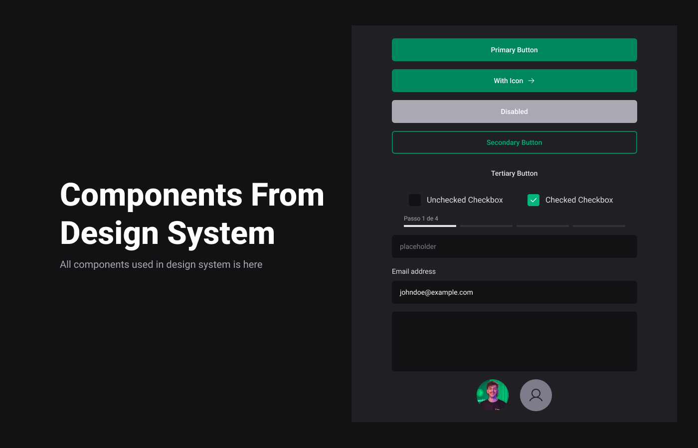

<p align="center">
  
</p>

<p align="center">
  
  
  

  
</p>

<h1 align="center">
  Design System Ignite
</h1>

<br>

## 🧪 Technologies

This project was developed using the following technologies:

- [ReactJS](https://reactjs.org/)
- [Stitches](https://stitches.dev/)
- [Figma](https://figma.com)
- [Storybook](https://storybook.js.org/)
- [Vite](https://vitejs.dev/)
- [TurboRepo](https://turbo.build/)
- [Tsup](https://tsup.egoist.dev/)
- [RadixUI](https://www.radix-ui.com/)

## 🚀 Getting started

Clone the project and access the folder.

```bash
git clone https://github.com/NitoBa/ignite-design-system

cd ignite-design-system
```

Run this command to install the dependencies

```bash
npm install
```

Run this command to view the interface locally

```bash
npm run dev
```

## 🔖 Layout

You can view the layout through the link below:

- [Figma Layout](https://www.figma.com/community/file/1161274296921389678)

You can view the storybook component docs through the link below:

- [Storybook components docs](https://nitoba.github.io/nito-design-system)

# Components In Design System

- [x] -> Text
- [x] -> Heading
- [x] -> Box
- [x] -> Button
- [x] -> TextInput
- [x] -> CheckBox
- [x] -> MultiStep

## 📝 License

This project is licensed under the MIT License. See the [LICENSE](LICENSE) file for details.

---

Made with 💜 by [Bruno Alves](https://nito-dev.vercel.app/) 👋
